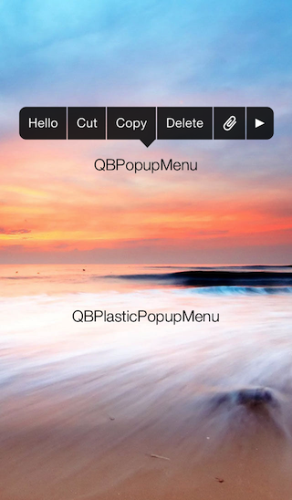
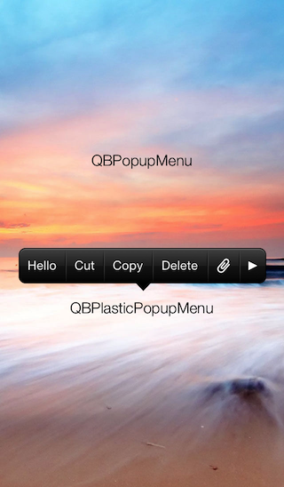

# QBPopupMenu
Customizable popup menu for iOS.

**QBPopupMenu version 2.0 is now available.**  
Its appearance is similar to `UIMenuController` of iOS 7, and it has several new features.

## Screenshot

## Installation
QBPopupMenu is available in CocoaPods.

    pod 'QBPopupMenu'

If you want to install manually, download this repository and copy files in QBPopupMenu directory to your project.

## Feature
### Customizable Appearance
QBPopupMenu is highly customizable, so you can create your own popup menu.

The simple way to customize is set `color` and `highlightcolor` property of `QBPopupMenu`.  
If you want to customize deeply, you should create a subclass of `QBPopupMenu` and override some drawing methods.

`QBPlasticPopupMenu` class in this repository is a good example of subclassing.

### Auto Pagenation
If you add many items to `QBPopupMenu`, it create pages and pagenator automatically.

### Auto Bounding
`QBPopupMenu` automatically adjust its frame depending on the frame of target view.

<!-- MacBuildServer Install Button -->

     <a href="http://macbuildserver.com/github/opensource/" target="_blank">by MacBuildServer</a>

<!-- MacBuildServer Install Button -->

## Example
    QBPopupMenuItem *item = [QBPopupMenuItem itemWithTitle:@"Text" target:self action:@selector(action:)];
    QBPopupMenuItem *item2 = [QBPopupMenuItem itemWithImage:[UIImage imageNamed:@"image"] target:self action:@selector(action:)];

    QBPopupMenu *popupMenu = [[QBPopupMenu alloc] initWithItems:@[item, item2]];

    [popupMenu showInView:self.view targetRect:... animated:YES];

## License
*QBPopupMenu* is released under the **MIT License**, see *LICENSE.txt*.
